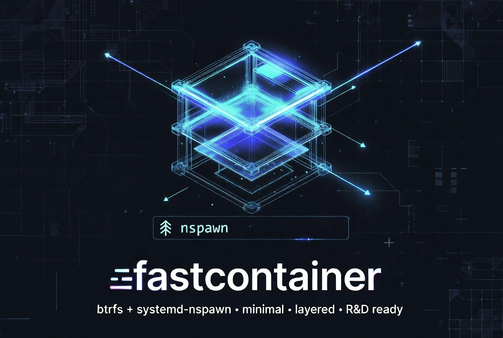

fastcontainer - Minimal btrfs + systemd-nspawn layered container builder
============================================================================

<div align="center">
  
</div>

### Installation

```bash
# 1. Clone the repository
git clone https://github.com/paulalesius/fastcontainer.git
cd fastcontainer

# 2. Recommended: install with uv
uv sync --force-reinstall
```

### Design Philosophy — Built for R&D, not production hardening

fastcontainer is intentionally minimal. It gives you fast, reproducible, layered containers using only btrfs snapshots and `systemd-nspawn`. No Dockerfiles, no OCI images, no daemon, no registry — just plain directories on a btrfs filesystem that you can inspect, modify, or delete with normal tools.

Perfect for machine-learning research, GPU-heavy experiments, and any workflow where you want full control and instant rebuilds of intermediate layers.

### Quick Start

```bash
sudo fastcontainer build <containers_dir> <prepare.yaml> -p <profile> [-v] [--prune] [-s] [-D KEY=VALUE]... [-- <command...>]
```

### Per-Step User (`RUN(user):` / `USE(user):` / `cmd(user):`)

You can now specify **which user** a build step or post-build command runs as:

```yaml
steps:
  - RUN(root): |
      whoami > /as-root.txt

  - RUN(noname): |
      whoami > /as-noname.txt
      id

  - RUN({{MYUSER}}): |      # variables are fully supported
      echo "running as {{MYUSER}}"

  - USE(root): my-snippet   # snippet runs as root

  - RUN: |                  # plain RUN: still defaults to root
      echo "plain RUN is root"
```

**For the final command:**

```yaml
cmd(noname): |
  echo "=== Starting benchmark as $(whoami) ==="
  /llama.cpp/build/bin/llama-bench ...

# or keep the old style (still works)
cmd: |
  echo "this runs as root"
```

**Important rules:**
- The default user is always **`root`**.
- You **cannot** use `--user` or `-u` in any `add:` section anymore (fastcontainer will raise a clear error). The user is now controlled **only** per-step.
- The debug shell on build failure now automatically runs as the same user as the failing step.
- The interactive shell (`-s`) on success runs as the `cmd(user)` you defined.
- User changes are part of the cache fingerprint — changing the user forces a rebuild of that layer.

### Interactive Shell (`-s` / `--shell`) — New in v0.7.0

Pass `-s` (or `--shell`) to drop into an interactive shell:

- On **build failure** → shell opens inside the temporary failing layer (you can debug/fix things).
- On **successful build** → shell opens inside the final image instead of running `cmd:`.

The shell always respects the user defined for that step/profile.

### Variables (`-D`) and `env:` — **New in v0.9.1**

All variables used with `{{VAR}}` must now be explicitly declared in a top-level `env:` section (in the current YAML or any `import-base:`).

```yaml
env:
  HOST_CACHE: /tmp/default-cache          # default value
  NVIDIA_DRIVER_VERSION: 595.58.03
  USER_HOME_DIR: /home/noname
  CACHE_STORE_DIR: /data/fastcontainer-cache

base:
  create: |
    debootstrap --cache-dir={{CACHE_STORE_DIR}}/debootstrap ...

profiles:
  common:
    add:
      - "--bind={{CACHE_STORE_DIR}}/apt-cache:/var/cache/apt"
      - "--bind={{HOST_CACHE}}:/root/.cache"
```

**Rules:**
- `{{VAR}}` can only be used for variables listed in `env:` (anywhere in the inheritance/import tree).
- `-D KEY=VALUE` on the command line can **only** override variables that are declared in `env:`.
- Local `env:` overrides imported `env:`.
- Clear error messages are shown for:
  - Using an undeclared `{{VAR}}`
  - Passing a `-D` for a variable that is not in any `env:`

**Example command:**
```bash
sudo fastcontainer build ... -p default \
  -D HOST_CACHE=/home/noname/.cache \
  -D CACHE_STORE_DIR=/my/custom/cache
```

Variables are supported in `base.create:`, `base.add:`, `add:`, `steps:`, `cmd:`, `check:`, and snippets.

### Profiles & Inheritance

```yaml
profiles:
  common:
    add:
      - "--tmpfs=/var/tmp"
      - "--private-users=no"
      - "--resolv-conf=replace-stub"
      - "--timezone=off"
    steps:
      - RUN: |
          apt-get update && apt-get install -y ...

  cuda:
    extend: common          # inherits add: + steps: from common
    steps:
      - RUN: |
          # CUDA-specific steps here
```

### Base Import (`import-base:`) — **New in v0.9.0+**

Extract common bases, snippets, and profiles into reusable library files.  
**Supports full chaining** — you can have `three.yaml` → `two.yaml` → `one.yaml` (and so on).

**Library file** (`one.yaml`):
```yaml
base:
  name: ubuntu-noble-minimal
  create: |
    debootstrap --variant=minbase noble . http://archive.ubuntu.com/ubuntu/

profiles:
  common:
    add:
      - "--tmpfs=/var/tmp"
      - "--private-users=no"
      - "--resolv-conf=replace-stub"
      - "--timezone=off"
    steps:
      - RUN: |
          apt-get update
          apt install -y software-properties-common wget git ...
```

**Intermediate file** (`two.yaml`):
```yaml
import-base: one.yaml
profiles:
  cuda:
    extend: common
    steps:
      - RUN: |
          # CUDA-specific steps...
```

**Project file** (`three.yaml`):
```yaml
import-base: two.yaml

profiles:
  run-llama-cpp:
    extend: cuda
    # your final add: / cmd: / steps: ...
```

**Rules (updated):**
- Use **either** `base:` **or** `import-base:`, never both (clear error if both are present).
- The deepest file in the chain **must** contain a `base:` section.
- `profiles:`, `snippets:`, and `env:` are merged recursively. Local values always override imported ones.
- `extend:` works transparently across the entire import chain.
- Paths are resolved relative to the importing YAML file.
- Circular imports are detected and rejected with a clear error.
- Arbitrary depth is supported (not limited to one level).

This makes large projects dramatically shorter while keeping all the shared knowledge in one maintainable place.

### Reusable Snippets (`snippets:` + `USE:`)

```yaml
snippets:
  build-llama:
    RUN: |
      git clone https://github.com/ggml-org/llama.cpp.git
      cd llama.cpp
      cmake -B build -DGGML_CUDA=ON && cmake --build build --config Release -j $(nproc)

profiles:
  llama-cpp:
    steps:
      - USE(root): build-llama     # runs the snippet as root
```

### Post-build command (`cmd:`)

Define a default command that runs automatically after a successful build:

```yaml
cmd(noname): |
  echo "=== Starting llama-bench as $(whoami) ==="
  /llama.cpp/build/bin/llama-bench ...
```

You can also pass a trailing command on the CLI:

```bash
sudo fastcontainer build ... -p myprofile -- echo "one-off command"
```

**Important:** The `cmd:` (and any trailing command) runs in an **ephemeral** container (`--ephemeral`). Any changes made are discarded after it finishes. The final cached image is never modified.

### Examples

```bash
# Basic build
sudo fastcontainer build /disk/fastcontainer ./sample/sample.yaml -p default \
  -D HOST_CACHE=/home/noname/.cache

# Full GPU + runtime variant (using import-base)
sudo fastcontainer build /disk/fastcontainer ./sample/ubuntu24.04-cu132-llama-cpp.yaml -p run-llama-cpp

# Build and immediately drop into a shell (success or failure)
sudo fastcontainer build ... -p default -s

# Verbose build
sudo fastcontainer build ... -v
```

**Final image name format:**  
`<effective_base>-<profile>-<40hex_fingerprint>`

### Other features

- Per-step users (`RUN(user):`, `USE(user):`, `cmd(user):`) — v0.8.0
- Base library import via `import-base:` — v0.9.0
- `-s` / `--shell`: interactive shell on failure **or** success — v0.7.0
- `--prune`: delete all intermediate layers after a successful build
- Automatic build lock (`.fastcontainer.lock`)
- Every layer contains a `fastcontainer.json` manifest with full build history
- Reusable `snippets:` + `USE:` syntax

### Contributing & Development

```bash
# Regenerate the full source prompt for AI assistance
bash scripts/project-to-prompt.sh
```

---

**Happy container building!**  
If you have questions or ideas for the next feature, open an issue or just ping me.
