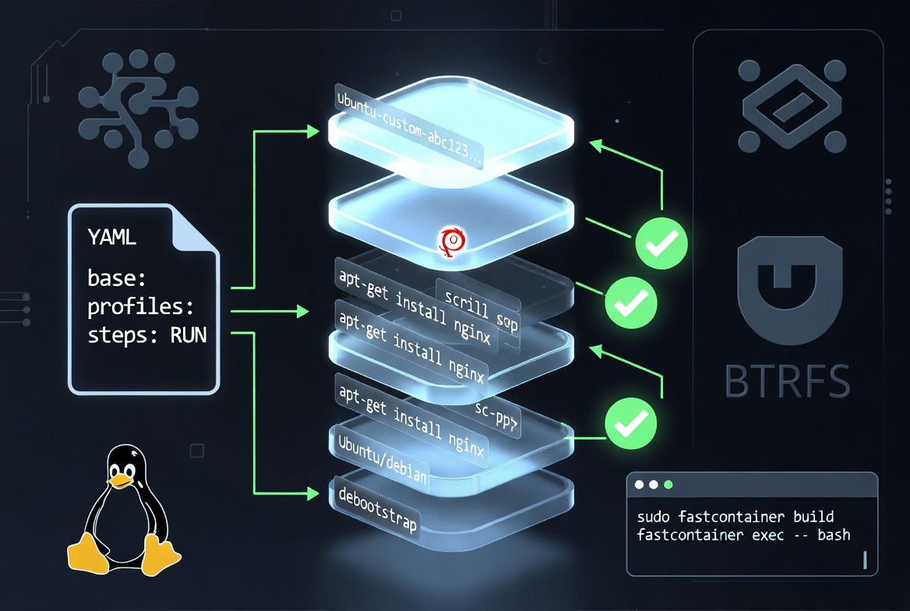

fastcontainer - Minimal btrfs + systemd-nspawn layered container builder
============================================================================

<div align="center">
  
</div>

### Installation

```bash
# 1. Clone the repository
git clone https://github.com/paulalesius/fastcontainer.git
cd fastcontainer

# 2. Recommended: install with uv
uv sync --force-reinstall
```

### Design Philosophy — Built for R&D, not production hardening

*(unchanged — same as your current README)*

### Quick Start

```bash
sudo fastcontainer build <containers_dir> <prepare.yaml> -p <profile> [-v] [--prune] [-s] [-D KEY=VALUE]... [-- <command...>]

sudo fastcontainer exec <containers_dir> <image-name> <command...> [-v]
```

### Per-Step User (`RUN(user):` / `USE(user):` / `cmd(user):`)

You can now specify **which user** a build step or post-build command runs as:

```yaml
steps:
  - RUN(root): |
      whoami > /as-root.txt

  - RUN(noname): |
      whoami > /as-noname.txt
      id

  - RUN({{MYUSER}}): |      # variables are fully supported
      echo "running as {{MYUSER}}"

  - USE(root): my-snippet   # snippet runs as root

  - RUN: |                  # plain RUN: still defaults to root
      echo "plain RUN is root"
```

**For the final command:**

```yaml
cmd(noname): |
  echo "=== Starting benchmark as $(whoami) ==="
  /llama.cpp/build/bin/llama-bench ...

# or keep the old style (still works)
cmd: |
  echo "this runs as root"
```

**Important rules:**
- The default user is always **`root`**.
- You **cannot** use `--user` or `-u` in any `add:` section anymore (fastcontainer will raise a clear error). The user is now controlled **only** per-step.
- The debug shell on build failure now automatically runs as the same user as the failing step.
- The interactive shell (`-s`) on success runs as the `cmd(user)` you defined.
- User changes are part of the cache fingerprint — changing the user forces a rebuild of that layer.

### Interactive Shell (`-s` / `--shell`) — **New in v0.7.0**

*(your existing section — unchanged)*

### Variables (`-D`)

*(your existing section — unchanged, it already mentions that variables work in RUN/USE/cmd)*

### Profiles & Inheritance (v0.6.0+)

```yaml
profiles:
  common:
    add:
      - "--tmpfs=/var/tmp"
      - "--private-users=no"
    steps:
      - RUN: |
          apt-get update && apt-get install -y ...
```

*(rest of the section unchanged)*

### Reusable Snippets (`snippets:` + `USE:`)

**New syntax:** `USE(user): snippet-name`

```yaml
snippets:
  build-llama:
    RUN: |
      git clone ...
      cmake ...

profiles:
  llama-cpp:
    steps:
      - USE(root): build-llama     # runs the snippet as root
```

### Post-build command (`cmd:`)

You can define a default command that runs automatically after a successful build:

```yaml
cmd(noname): |          # runs as the specified user
  echo "=== Starting llama-bench as $(whoami) ==="
  /llama.cpp/build/bin/llama-bench ...
```

**Important:** The `cmd:` (and any trailing command you pass on the CLI) now runs in an **ephemeral** container (`systemd-nspawn --ephemeral`).  
Any files created or modified during this command are **discarded** after it finishes. The final cached image is never changed by the post-build command.

This is by design: `cmd:` is only for one-off actions (benchmarks, tests, printing info, etc.). Use a `RUN:` step if you need persistent changes.


### Examples

```bash
# Basic build
sudo fastcontainer build /disk/fastcontainer ./sample/sample.yaml -p default \
  -D HOST_CACHE=/home/noname/.cache

# Full GPU + runtime variant
sudo fastcontainer build /disk/fastcontainer ./sample/ubuntu24.04-cu132-llama-cpp.yaml -p run-llama-cpp

# Build and immediately drop into a shell (success or failure)
sudo fastcontainer build ... -p default -s

# Verbose build
sudo fastcontainer build ... -v
```

**Final image name format:**  
`<effective_base>-<profile>-<40hex_fingerprint>`

### Other features

- Per-step users (`RUN(user):`, `USE(user):`, `cmd(user):`) — v0.8.0
- `-s` / `--shell`: interactive shell on failure **or** success (v0.7.0)
- `--prune`: delete all intermediate layers after a successful build.
- Automatic build lock (`.fastcontainer.lock`)
- Every layer contains a `fastcontainer.json` manifest with full build history.

### Contributing & Development

```bash
# Regenerate the full source prompt for AI assistance
bash scripts/project-to-prompt.sh
```

